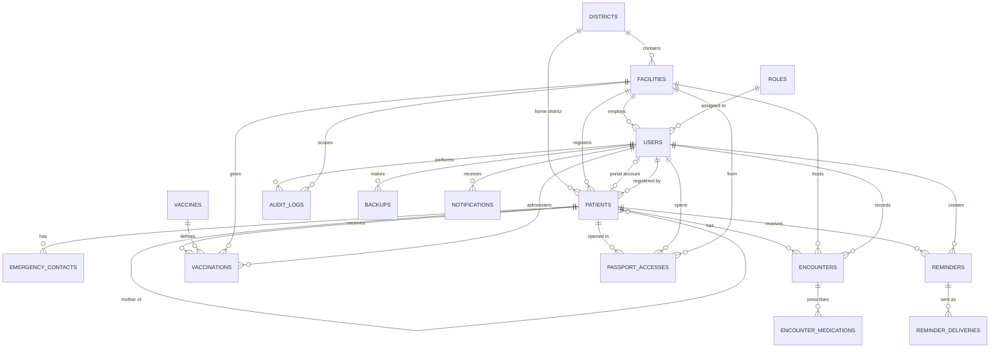
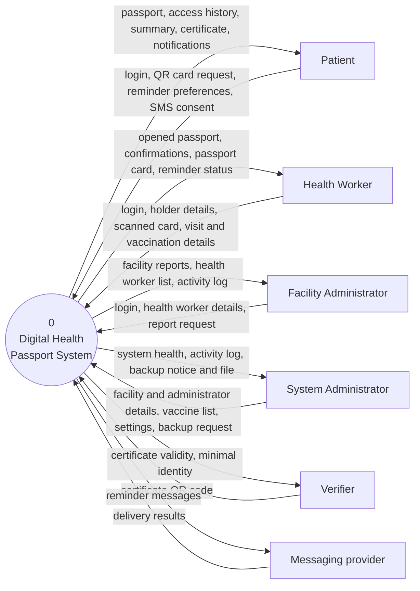
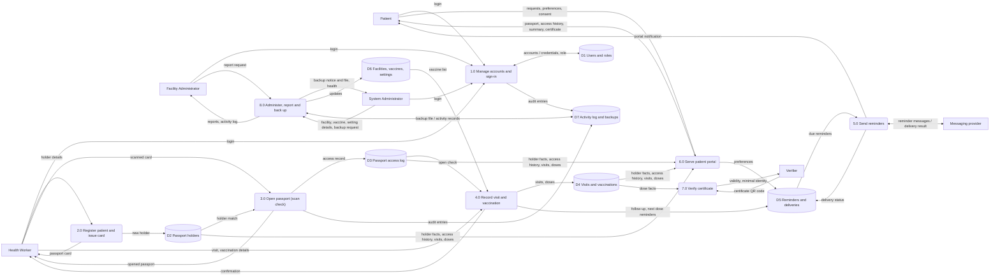
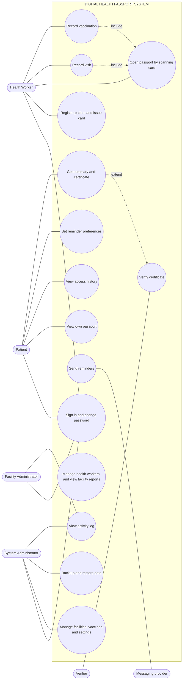

# Digital Health Passport System — System Design Artefacts

**Stack:** Laravel 12, PHP 8.3, MySQL 8.x, Blade, Tailwind CSS 3, Alpine.js, Vite
**Access control:** spatie/laravel-permission (four roles) + policies
**Methodology:** Rapid Application Development (RAD)

This file describes the system **as built**: the modules, functional and
non-functional requirements, ERD, DFD Level 0 and Level 1, Use Case diagram and
the MySQL implementation. Every table, role, permission and setting named here
exists in the Laravel code (`database/migrations`, `app/Enums`, `routes/web.php`).

**Scope.** The system is a *passport*: a record that belongs to the holder, is
carried on a card with a QR code, and is opened by a health worker only by
scanning that card. It is not a hospital management system, an electronic
medical record or an electronic health record. It has no appointments, wards,
laboratory, pharmacy, billing or announcements.

---

## 1. Roles

| Role | Code | Belongs to a facility | Created by |
|------|------|:-:|------------|
| System Administrator | `system_admin` | No | Seeder (first account) |
| Facility Administrator | `facility_admin` | Yes | System Administrator |
| Health Worker | `health_worker` | Yes | Facility Administrator |
| Patient (passport holder) | `patient` | No | Health worker, at registration ("portal account") |

Two other parties are **not** roles: the **Verifier** (any person holding a
printed vaccination certificate, no account) and the **Messaging provider**
(an external email / SMS service).

---

## 2. System Modules

| # | Module | Covers | Key actors |
|---|--------|--------|------------|
| M1 | Accounts and Access | Sign-in by email + password, forced password change on first use, password reset, login rate limit, role-based access control | All users |
| M2 | Facility and Reference Setup | Facilities, districts, facility administrators, vaccine list, system settings, lists (facility types, regions, medicine frequencies) | System Administrator |
| M3 | Facility Staff and Reports | Create / edit / deactivate health workers, reset passwords, facility profile, facility reports | Facility Administrator |
| M4 | Patient Registration and Card | Register a holder, passport number + QR token, emergency contacts, child → mother link, printable passport card, portal account | Health Worker |
| M5 | Scan-first Passport Access | Open a passport by QR scan (or passport number / identity check), time-limited access window, access record, close passport | Health Worker |
| M6 | Visit and Vaccination Records | Visits (reason, vitals, diagnosis, treatment, medicines, follow-up), vaccinations with next-dose date | Health Worker |
| M7 | Reminders and Notifications | Follow-up and next-dose reminders; portal, email and SMS channels; holder preferences and SMS consent; delivery status | System, Messaging provider |
| M8 | Patient Portal | Own passport, access history, printable summary, vaccination certificate, reminder preferences | Patient |
| M9 | Certificate Verification | Vaccination certificate with signed QR link; public verification showing minimal data | Verifier (public) |
| M10 | Audit, Backup and System Health | Activity log, encrypted backups (scheduled and on demand), download and restore, backup notice to administrators, system health | System Administrator, Facility Administrator (own facility's log) |
| M11 | Offline Support | Scan page available without a connection; visit and vaccination notes typed offline, kept on the device, synchronised to the opened passport | Health Worker |

Services: `PatientRegistrationService`, `PassportAccessService`, `StaffAccountService`,
`ReminderService`, `QrCodeService`, `SmsManager` (Twilio / Africa's Talking / log driver),
`BackupService`, `SettingService`, `AuditLogger`.

---

## 3. Functional Requirements

### M1 — Accounts and Access

| ID | Requirement |
|----|-------------|
| FR-1 | The system shall let a user sign in with email and password; passwords are stored hashed. Failed sign-ins are limited to 5 per minute. |
| FR-2 | A user whose account was created by someone else (staff, patient portal account) or reset shall be made to choose a new password before using the system. |
| FR-3 | After sign-in the system shall send the user to the dashboard of their role. |
| FR-4 | The system shall enforce permissions on the server for every request; hiding a menu item is not security. |

### M2 / M3 — Facilities, Staff and Reports

| ID | Requirement |
|----|-------------|
| FR-5 | The System Administrator shall register and edit facilities and activate / deactivate them, and shall manage districts. |
| FR-6 | The System Administrator shall create, edit, deactivate and reset the password of Facility Administrators. |
| FR-7 | The System Administrator shall maintain the vaccine list (name, protects against, doses, days between doses, recommended age) and the system settings. |
| FR-8 | A Facility Administrator shall create, edit, deactivate and reset the password of Health Workers of their own facility only. |
| FR-9 | A Facility Administrator shall update the facility profile and view reports of registrations, visits and vaccinations for their facility. |

### M4 / M5 — Registration and Scan-first Access

| ID | Requirement |
|----|-------------|
| FR-10 | A Health Worker shall register a holder (identity, contact, address, blood group, allergies, emergency contacts); the system shall generate a unique passport number and a unique QR token, and shall reject a duplicate National ID. |
| FR-11 | A child may be linked to the mother; the link can only be made through the mother's open passport. |
| FR-12 | The system shall print a passport card carrying the holder's name, passport number and QR code (`DHP:<token>`). |
| FR-13 | A passport shall stay **closed** until a Health Worker scans the card (or enters the passport number with an identity check). The system shall then open it for the number of minutes set in settings (default 30) and write an access record. Every other request for the passport shall be refused by the server. |
| FR-14 | Administrators shall not be able to open a passport. |
| FR-15 | The system shall limit passport opening to 20 attempts per minute per user. |

### M6 — Visit and Vaccination Records

| ID | Requirement |
|----|-------------|
| FR-16 | A Health Worker with an open passport shall record a visit: reason, vital signs within the configured limits, diagnosis, treatment summary, up to 10 medicines and an optional follow-up date. |
| FR-17 | A Health Worker with an open passport shall record a vaccination (vaccine, dose number, date, batch number); the system shall calculate the next dose date from the vaccine rules and shall prevent the same dose being recorded twice. |
| FR-18 | The system shall show the visit history and vaccination history of an open passport in one place. |

### M7 — Reminders and Notifications

| ID | Requirement |
|----|-------------|
| FR-19 | The system shall create reminders for next doses and follow-ups and send those that are due each day. |
| FR-20 | A reminder shall go to the holder's portal, and by email and SMS when the matching setting is switched on and the holder has agreed (SMS needs recorded consent). SMS text shall carry no health details. |
| FR-21 | The holder shall choose which reminder categories (registration, vaccination, medication, follow-up) and channels they receive. |
| FR-22 | The system shall record the delivery result (sent, failed, skipped) of every reminder channel and show it to the health worker. |
| FR-23 | The system shall show unread notifications in the notification centre and refresh them while the page is open. |

### M8 / M9 — Patient Portal and Certificates

| ID | Requirement |
|----|-------------|
| FR-24 | A Patient shall see only their own passport: details, visits, vaccinations, emergency contacts and reminders. |
| FR-25 | A Patient shall see the access history: who opened the passport, from which facility, by which method and when. |
| FR-26 | A Patient shall print a summary and a vaccination certificate. |
| FR-27 | A vaccination certificate shall carry a QR code with a signed link; anyone with the link can verify it without signing in and sees only the holder's name, the vaccine, dose, date and whether it is genuine. |

### M10 / M11 — Audit, Backup and Offline

| ID | Requirement |
|----|-------------|
| FR-28 | The system shall record in the activity log who did what and when (sign-in, registration, passport opening, records, account and setting changes, backups). A System Administrator sees all entries; a Facility Administrator sees those of their facility. |
| FR-29 | The System Administrator shall make a backup on demand and every day at the set time; the file is encrypted with the application key, can be downloaded, and old copies are removed after the retention days (the three newest are always kept). |
| FR-30 | After every backup, successful or not, each System Administrator shall receive a notification and an email; the email of a successful backup carries a link to download the file after signing in. |
| FR-31 | The System Administrator shall restore a backup with the `backup:restore` command. |
| FR-32 | The scan page shall load without a connection. Visit and vaccination notes typed offline shall be kept on the device for the number of hours set in settings, and sent to the passport once the connection returns and the card has been scanned. |

### RBAC (as seeded)

| Permission | System Admin | Facility Admin | Health Worker | Patient |
|---|:-:|:-:|:-:|:-:|
| Manage facilities and districts (`facilities.manage`) | ✓ | | | |
| Manage facility administrators (`facility-administrators.manage`) | ✓ | | | |
| Change system settings (`system-settings.manage`) | ✓ | | | |
| Manage vaccine list (`vaccine-catalogue.manage`) | ✓ | | | |
| View system health (`system-health.view`) | ✓ | | | |
| Make, download, delete backups (`backups.manage`) | ✓ | | | |
| View activity log (`audit-logs.view`) | ✓ (all) | ✓ (own facility) | | |
| Manage health workers (`staff.manage`) | | ✓ | | |
| Update facility profile (`facility-profile.manage`) | | ✓ | | |
| View facility reports (`facility-reports.view`) | | ✓ | | |
| Open a passport by scan (`passports.open`) | | | ✓ | |
| Register patients, issue card (`patients.register`) | | | ✓ | |
| Edit personal details, emergency contacts (`patients.edit-demographics`) | | | ✓ | |
| Record visits (`encounters.record`) | | | ✓ | |
| Record vaccinations (`vaccinations.record`) | | | ✓ | |
| Set reminders (`reminders.manage`) | | | ✓ | |
| Use the patient portal (`portal.use`) | | | | ✓ |

The Verifier needs no permission: the verification page is public and protected by a signed link.

---

## 4. Non-Functional Requirements

| Category | Requirement |
|----------|-------------|
| Security | Hashed passwords; CSRF protection; Blade escaping against XSS; Eloquent against SQL injection; server-side policies on every passport request; login (5/min) and passport-open (20/min) rate limits; signed URLs for certificates; backups encrypted with `APP_KEY`; no secrets in code (`.env`) |
| Privacy | A passport is read only after a scan and while the access window is open; the holder sees every opening; SMS carries no health details and needs consent; a verifier sees minimal data |
| Performance | Scan, passport opening and history pages respond within a few seconds on a normal facility connection; lists are paged (15 per page) |
| Reliability | Database transactions for multi-step saves; daily backups with retention; failed reminder deliveries and failed backups are recorded and reported; test suite (PHPUnit, 45 tests) |
| Availability | The scan page and visit notes work without a connection and synchronise later (service worker + device queue) |
| Usability | Plain wording, role-appropriate menus, errors beside the field, mobile-first layout that works on phone, tablet and desktop |
| Data integrity | Unique passport number, QR token, National ID and dose per holder; foreign keys; validation of vital-sign limits |
| Maintainability | Laravel conventions, services and policies, migrations and seeders; all changeable values (system name, passport prefix, access window, lists, notification switches) stored in the `settings` table, not in code; SMS provider chosen by `SMS_DRIVER` |
| Auditability | Important actions are written to `audit_logs` with user, facility, time and IP address |
| Compatibility | Current major browsers |

---

## 5. ERD



Data dictionary (main columns):

- `districts(id, name, region)`
- `facilities(id, name, code, type, ownership, district_id, physical_address, phone, email, status)`
- `users(id, name, email, phone, job_title, professional_registration_number, facility_id, patient_id, status, must_change_password, last_login_at, password, notification_preferences)`
- `roles`, `permissions`, `model_has_roles`, `model_has_permissions`, `role_has_permissions` (spatie/laravel-permission)
- `patients(id, passport_number, qr_token, national_id, first_name, middle_name, last_name, date_of_birth, sex, phone, email, sms_consent, district_id, traditional_authority, village, physical_address, occupation, blood_group, allergies, chronic_conditions, disabilities, health_notes, mother_id, separated_from_mother_at, registered_facility_id, registered_by, status)`
- `emergency_contacts(id, patient_id, full_name, relationship, phone, physical_address, is_primary)`
- `encounters(id, patient_id, facility_id, recorded_by, reason, diagnosis, treatment_summary, follow_up_on, temperature, weight, height, systolic_pressure, diastolic_pressure, pulse_rate, oxygen_saturation, recorded_at)`
- `encounter_medications(id, encounter_id, name, dosage, frequency, duration_days)`
- `vaccines(id, name, protects_against, total_doses, days_between_doses, recommended_age, is_active)`
- `vaccinations(id, patient_id, vaccine_id, facility_id, administered_by, dose_number, administered_on, batch_number, next_dose_due_on, notes)`
- `passport_accesses(id, patient_id, user_id, facility_id, method, opened_at, expires_at, closed_at)`
- `reminders(id, patient_id, category, title, message, due_on, repeat_every_days, is_confidential, status, last_sent_at, source_type, source_id, created_by)`
- `reminder_deliveries(id, reminder_id, batch, channel, status, detail)`
- `notifications(id, type, notifiable_type, notifiable_id, data, read_at)` (Laravel database notifications)
- `audit_logs(id, user_id, facility_id, action, subject_type, subject_id, description, ip_address, created_at)`
- `backups(id, filename, size_bytes, status, trigger, error, created_by)`
- `settings(id, key, value, label, group, input_type, help_text)`
- Framework tables: `sessions`, `password_reset_tokens`, `cache`, `cache_locks`, `jobs`, `job_batches`, `failed_jobs`

Relationships: one District → many Facilities and Patients; one Facility → many Users, Encounters, Vaccinations and Passport accesses; one Patient → many Emergency contacts, Encounters, Vaccinations, Passport accesses and Reminders; a Patient may be the child of another Patient (`mother_id`); one Encounter → many Medications; one Vaccine → many Vaccinations; one Reminder → many Deliveries; one User → many Audit entries; a Patient has at most one portal User (`users.patient_id` is unique).

---

## 6. DFD Level 0 (Context Diagram)



| Flow | Description |
|------|-------------|
| Patient ↔ System | Sign-in, reminder preferences and SMS consent, requests for summary / certificate / card; passport, access history, certificate, notifications |
| Health Worker ↔ System | Sign-in, registration details, scanned card, visit and vaccination details; opened passport, confirmations, passport card, reminder delivery status |
| Facility Administrator ↔ System | Sign-in, health worker accounts, report requests; reports, activity log |
| System Administrator ↔ System | Facilities, facility administrators, vaccine list, settings, backup request; system health, activity log, backup notice and file |
| Verifier ↔ System | Certificate QR code; validity and minimal identity |
| System ↔ Messaging provider | Reminder messages (email / SMS); delivery results |

---

## 7. DFD Level 1 (Decomposition)



| Process | Inputs | Outputs | Stores |
|---------|--------|---------|--------|
| 1.0 Manage accounts and sign-in | Email + password, account details of staff / facility administrators, password changes | Session and role dashboard, accounts, audit entries | D1, D7 |
| 2.0 Register patient and issue card | Holder details, emergency contacts, mother link | Holder with passport number and QR token, printable card, portal account | D2 |
| 3.0 Open passport (scan check) | Scanned card (or passport number + identity check) | Opened passport for a limited time, access record | D2, D3, D7 |
| 4.0 Record visit and vaccination | Visit and vaccination details (also synchronised from offline notes) | Saved visit / dose, next-dose date, reminders | D3 (open check), D4, D5, D6 |
| 5.0 Send reminders | Due reminders, holder preferences and consent | Portal notification, email / SMS, delivery status | D5 |
| 6.0 Serve patient portal | Holder requests, preferences, SMS consent | Own passport, access history, summary, certificate | D2, D3, D4, D5 |
| 7.0 Verify certificate | Certificate QR code (signed link) | Validity and minimal identity | D4 |
| 8.0 Administer, report and back up | Facility, vaccine and setting details, report and backup requests | Updated reference data, facility reports, activity log, encrypted backup file and notice | D6, D7 |

---

## 8. Use Case Diagram

Actors: **Patient**, **Health Worker**, **Facility Administrator**,
**System Administrator**, **Verifier** (public, no account) and the
**Messaging provider** (external system).



Use-case descriptions:

| UC | Name | Actor(s) | Precondition | Main flow | Postcondition |
|----|------|----------|--------------|-----------|---------------|
| UC1 | Sign in and change password | Patient, Health Worker, Facility Admin, System Admin | Active account | Enter email and password → system checks hash and active status → forced new password on first sign-in → role dashboard | Session started; sign-in logged; failures limited to 5/min |
| UC2 | Register patient and issue card | Health Worker | Signed in, belongs to a facility | Enter identity, contact, emergency contacts (and mother for a child) → duplicate National ID check → system creates holder, passport number, QR token and portal account → show card | Holder exists; card printable; registration logged |
| UC3 | Open passport by scanning card | Health Worker | Signed in; card present | Scan QR (or passport number + identity check) → system confirms an active holder → opens passport for the set minutes → writes access record | Passport open for this worker only until it expires or is closed |
| UC4 | Record visit | Health Worker | Passport open (UC3) | Enter reason, vitals, diagnosis, treatment, medicines, follow-up date → system saves | Visit in history; follow-up reminder created |
| UC5 | Record vaccination | Health Worker | Passport open (UC3) | Choose vaccine, dose, date, batch → system saves and calculates next dose | Dose saved; next-dose reminder created |
| UC6 | View own passport | Patient | Signed in to portal | Open My passport | Read-only view of own passport |
| UC7 | View access history | Patient | Signed in to portal | Open Access history | List of who opened the passport, where, how and when |
| UC8 | Set reminder preferences | Patient | Signed in to portal | Choose categories and channels; give or withdraw SMS consent | Reminders follow the choices |
| UC9 | Get summary and certificate | Patient | Signed in; at least one vaccination (certificate) | Open Summary or Certificate → system builds printable page with signed QR link → print / save as PDF | Summary or certificate in hand |
| UC10 | Send reminders | Messaging provider (started by scheduler) | Reminders due; notification settings on | Select due reminders → check preferences and consent → send portal / email / SMS → record result | Delivery status stored per channel |
| UC11 | Manage health workers and view facility reports | Facility Admin | Signed in | Create / edit / deactivate / reset health worker; open reports for a period | Accounts current; reports shown; changes logged |
| UC12 | Manage facilities, vaccines and settings | System Admin | Signed in | Create / edit facilities and administrators; maintain vaccine list and settings | Reference data updated; changes logged |
| UC13 | Back up and restore data | System Admin | Signed in; backup enabled | Back up now or at 02:00 → system writes encrypted file, notifies and emails administrators → download from Backups page; restore with `php artisan backup:restore` | Encrypted copy exists; failure reported by email |
| UC14 | Verify certificate | Verifier | Certificate with signed link | Scan QR on certificate → system checks signature → shows name, vaccine, dose, date and validity | Authenticity known without an account |
| UC15 | View activity log | Facility Admin (own facility), System Admin (all) | Signed in | Open the activity log and filter | Entries shown |

---

## 9. MySQL Database Implementation (MySQL 8.x / InnoDB)

Matches the migrations in `database/migrations`. Run in order. `migrate:fresh --seed`
remains the canonical way to build the database; this script is the same structure
for documentation and for phpMyAdmin.

```sql
CREATE DATABASE IF NOT EXISTS digital_health_passport
  CHARACTER SET utf8mb4 COLLATE utf8mb4_unicode_ci;
USE digital_health_passport;

CREATE TABLE districts (
  id BIGINT UNSIGNED AUTO_INCREMENT PRIMARY KEY,
  name VARCHAR(255) NOT NULL,
  region VARCHAR(255) NOT NULL,
  created_at TIMESTAMP NULL DEFAULT NULL,
  updated_at TIMESTAMP NULL DEFAULT NULL,
  UNIQUE KEY uq_districts_name (name)
) ENGINE=InnoDB;

CREATE TABLE facilities (
  id BIGINT UNSIGNED AUTO_INCREMENT PRIMARY KEY,
  name VARCHAR(255) NOT NULL,
  code VARCHAR(30) NOT NULL,
  type VARCHAR(50) NOT NULL,
  ownership VARCHAR(50) NOT NULL,
  district_id BIGINT UNSIGNED NOT NULL,
  physical_address VARCHAR(255) NULL,
  phone VARCHAR(30) NULL,
  email VARCHAR(255) NULL,
  status VARCHAR(20) NOT NULL DEFAULT 'active',
  created_at TIMESTAMP NULL DEFAULT NULL,
  updated_at TIMESTAMP NULL DEFAULT NULL,
  UNIQUE KEY uq_facilities_name (name),
  UNIQUE KEY uq_facilities_code (code),
  KEY idx_facilities_status (status),
  CONSTRAINT fk_facilities_district FOREIGN KEY (district_id)
    REFERENCES districts (id) ON DELETE RESTRICT
) ENGINE=InnoDB;

CREATE TABLE users (
  id BIGINT UNSIGNED AUTO_INCREMENT PRIMARY KEY,
  name VARCHAR(255) NOT NULL,
  email VARCHAR(255) NOT NULL,
  phone VARCHAR(30) NULL,
  job_title VARCHAR(100) NULL,
  professional_registration_number VARCHAR(50) NULL,
  facility_id BIGINT UNSIGNED NULL,
  status VARCHAR(20) NOT NULL DEFAULT 'active',
  must_change_password TINYINT(1) NOT NULL DEFAULT 1,
  notification_preferences JSON NULL,
  last_login_at TIMESTAMP NULL DEFAULT NULL,
  password VARCHAR(255) NOT NULL,
  remember_token VARCHAR(100) NULL,
  created_at TIMESTAMP NULL DEFAULT NULL,
  updated_at TIMESTAMP NULL DEFAULT NULL,
  UNIQUE KEY uq_users_email (email),
  KEY idx_users_status (status),
  CONSTRAINT fk_users_facility FOREIGN KEY (facility_id)
    REFERENCES facilities (id) ON DELETE SET NULL
) ENGINE=InnoDB;

CREATE TABLE settings (
  id BIGINT UNSIGNED AUTO_INCREMENT PRIMARY KEY,
  `key` VARCHAR(255) NOT NULL,
  value TEXT NULL,
  label VARCHAR(255) NOT NULL,
  `group` VARCHAR(50) NOT NULL DEFAULT 'general',
  input_type VARCHAR(20) NOT NULL DEFAULT 'text',
  help_text VARCHAR(255) NULL,
  created_at TIMESTAMP NULL DEFAULT NULL,
  updated_at TIMESTAMP NULL DEFAULT NULL,
  UNIQUE KEY uq_settings_key (`key`)
) ENGINE=InnoDB;

CREATE TABLE patients (
  id BIGINT UNSIGNED AUTO_INCREMENT PRIMARY KEY,
  passport_number VARCHAR(30) NOT NULL,
  qr_token VARCHAR(64) NOT NULL,
  national_id VARCHAR(20) NULL,
  first_name VARCHAR(100) NOT NULL,
  middle_name VARCHAR(100) NULL,
  last_name VARCHAR(100) NOT NULL,
  date_of_birth DATE NOT NULL,
  sex VARCHAR(10) NOT NULL,
  phone VARCHAR(30) NULL,
  email VARCHAR(255) NULL,
  sms_consent TINYINT(1) NOT NULL DEFAULT 0,
  district_id BIGINT UNSIGNED NULL,
  traditional_authority VARCHAR(100) NULL,
  village VARCHAR(100) NULL,
  physical_address VARCHAR(255) NULL,
  occupation VARCHAR(100) NULL,
  blood_group VARCHAR(5) NULL,
  allergies TEXT NULL,
  chronic_conditions TEXT NULL,
  disabilities TEXT NULL,
  health_notes TEXT NULL,
  mother_id BIGINT UNSIGNED NULL,
  separated_from_mother_at TIMESTAMP NULL DEFAULT NULL,
  registered_facility_id BIGINT UNSIGNED NULL,
  registered_by BIGINT UNSIGNED NULL,
  status VARCHAR(20) NOT NULL DEFAULT 'active',
  created_at TIMESTAMP NULL DEFAULT NULL,
  updated_at TIMESTAMP NULL DEFAULT NULL,
  UNIQUE KEY uq_patients_passport (passport_number),
  UNIQUE KEY uq_patients_qr (qr_token),
  UNIQUE KEY uq_patients_national_id (national_id),
  KEY idx_patients_status (status),
  KEY idx_patients_name (last_name, first_name),
  CONSTRAINT fk_patients_district FOREIGN KEY (district_id)
    REFERENCES districts (id) ON DELETE SET NULL,
  CONSTRAINT fk_patients_mother FOREIGN KEY (mother_id)
    REFERENCES patients (id) ON DELETE SET NULL,
  CONSTRAINT fk_patients_facility FOREIGN KEY (registered_facility_id)
    REFERENCES facilities (id) ON DELETE SET NULL,
  CONSTRAINT fk_patients_registered_by FOREIGN KEY (registered_by)
    REFERENCES users (id) ON DELETE SET NULL
) ENGINE=InnoDB;

-- A patient's portal account: one user per holder.
ALTER TABLE users
  ADD COLUMN patient_id BIGINT UNSIGNED NULL AFTER facility_id,
  ADD UNIQUE KEY uq_users_patient (patient_id),
  ADD CONSTRAINT fk_users_patient FOREIGN KEY (patient_id)
    REFERENCES patients (id) ON DELETE SET NULL;

CREATE TABLE emergency_contacts (
  id BIGINT UNSIGNED AUTO_INCREMENT PRIMARY KEY,
  patient_id BIGINT UNSIGNED NOT NULL,
  full_name VARCHAR(150) NOT NULL,
  relationship VARCHAR(50) NOT NULL,
  phone VARCHAR(30) NOT NULL,
  physical_address VARCHAR(255) NULL,
  is_primary TINYINT(1) NOT NULL DEFAULT 0,
  created_at TIMESTAMP NULL DEFAULT NULL,
  updated_at TIMESTAMP NULL DEFAULT NULL,
  CONSTRAINT fk_ec_patient FOREIGN KEY (patient_id)
    REFERENCES patients (id) ON DELETE CASCADE
) ENGINE=InnoDB;

CREATE TABLE encounters (
  id BIGINT UNSIGNED AUTO_INCREMENT PRIMARY KEY,
  patient_id BIGINT UNSIGNED NOT NULL,
  facility_id BIGINT UNSIGNED NOT NULL,
  recorded_by BIGINT UNSIGNED NULL,
  reason VARCHAR(255) NOT NULL,
  diagnosis VARCHAR(255) NULL,
  treatment_summary TEXT NULL,
  follow_up_on DATE NULL,
  temperature DECIMAL(4,1) NULL,
  weight DECIMAL(5,1) NULL,
  height DECIMAL(5,1) NULL,
  systolic_pressure SMALLINT UNSIGNED NULL,
  diastolic_pressure SMALLINT UNSIGNED NULL,
  pulse_rate SMALLINT UNSIGNED NULL,
  oxygen_saturation TINYINT UNSIGNED NULL,
  recorded_at DATETIME NOT NULL,
  created_at TIMESTAMP NULL DEFAULT NULL,
  updated_at TIMESTAMP NULL DEFAULT NULL,
  KEY idx_enc_patient (patient_id, recorded_at),
  KEY idx_enc_facility (facility_id, recorded_at),
  CONSTRAINT fk_enc_patient FOREIGN KEY (patient_id)
    REFERENCES patients (id) ON DELETE CASCADE,
  CONSTRAINT fk_enc_facility FOREIGN KEY (facility_id)
    REFERENCES facilities (id) ON DELETE RESTRICT,
  CONSTRAINT fk_enc_user FOREIGN KEY (recorded_by)
    REFERENCES users (id) ON DELETE SET NULL
) ENGINE=InnoDB;

CREATE TABLE encounter_medications (
  id BIGINT UNSIGNED AUTO_INCREMENT PRIMARY KEY,
  encounter_id BIGINT UNSIGNED NOT NULL,
  name VARCHAR(150) NOT NULL,
  dosage VARCHAR(100) NOT NULL,
  frequency VARCHAR(100) NOT NULL,
  duration_days SMALLINT UNSIGNED NULL,
  created_at TIMESTAMP NULL DEFAULT NULL,
  updated_at TIMESTAMP NULL DEFAULT NULL,
  CONSTRAINT fk_em_encounter FOREIGN KEY (encounter_id)
    REFERENCES encounters (id) ON DELETE CASCADE
) ENGINE=InnoDB;

-- Every opening of a passport. Data can be read only while one is open.
CREATE TABLE passport_accesses (
  id BIGINT UNSIGNED AUTO_INCREMENT PRIMARY KEY,
  patient_id BIGINT UNSIGNED NOT NULL,
  user_id BIGINT UNSIGNED NULL,
  facility_id BIGINT UNSIGNED NULL,
  method VARCHAR(30) NOT NULL,          -- qr_scan | passport_number | identity_check
  opened_at DATETIME NOT NULL,
  expires_at DATETIME NOT NULL,
  closed_at TIMESTAMP NULL DEFAULT NULL,
  created_at TIMESTAMP NULL DEFAULT NULL,
  updated_at TIMESTAMP NULL DEFAULT NULL,
  KEY idx_pa_user_patient (user_id, patient_id, expires_at),
  KEY idx_pa_patient (patient_id, opened_at),
  CONSTRAINT fk_pa_patient FOREIGN KEY (patient_id)
    REFERENCES patients (id) ON DELETE CASCADE,
  CONSTRAINT fk_pa_user FOREIGN KEY (user_id)
    REFERENCES users (id) ON DELETE SET NULL,
  CONSTRAINT fk_pa_facility FOREIGN KEY (facility_id)
    REFERENCES facilities (id) ON DELETE SET NULL
) ENGINE=InnoDB;

CREATE TABLE vaccines (
  id BIGINT UNSIGNED AUTO_INCREMENT PRIMARY KEY,
  name VARCHAR(150) NOT NULL,
  protects_against VARCHAR(255) NOT NULL,
  total_doses TINYINT UNSIGNED NOT NULL,
  days_between_doses SMALLINT UNSIGNED NULL,
  recommended_age VARCHAR(100) NULL,
  is_active TINYINT(1) NOT NULL DEFAULT 1,
  created_at TIMESTAMP NULL DEFAULT NULL,
  updated_at TIMESTAMP NULL DEFAULT NULL,
  UNIQUE KEY uq_vaccines_name (name)
) ENGINE=InnoDB;

CREATE TABLE vaccinations (
  id BIGINT UNSIGNED AUTO_INCREMENT PRIMARY KEY,
  patient_id BIGINT UNSIGNED NOT NULL,
  vaccine_id BIGINT UNSIGNED NOT NULL,
  facility_id BIGINT UNSIGNED NULL,
  administered_by BIGINT UNSIGNED NULL,
  dose_number TINYINT UNSIGNED NOT NULL,
  administered_on DATE NOT NULL,
  batch_number VARCHAR(50) NULL,
  next_dose_due_on DATE NULL,
  notes VARCHAR(255) NULL,
  created_at TIMESTAMP NULL DEFAULT NULL,
  updated_at TIMESTAMP NULL DEFAULT NULL,
  UNIQUE KEY uq_vacc_dose (patient_id, vaccine_id, dose_number),
  CONSTRAINT fk_vacc_patient FOREIGN KEY (patient_id)
    REFERENCES patients (id) ON DELETE CASCADE,
  CONSTRAINT fk_vacc_vaccine FOREIGN KEY (vaccine_id)
    REFERENCES vaccines (id) ON DELETE RESTRICT,
  CONSTRAINT fk_vacc_facility FOREIGN KEY (facility_id)
    REFERENCES facilities (id) ON DELETE SET NULL,
  CONSTRAINT fk_vacc_user FOREIGN KEY (administered_by)
    REFERENCES users (id) ON DELETE SET NULL
) ENGINE=InnoDB;

CREATE TABLE reminders (
  id BIGINT UNSIGNED AUTO_INCREMENT PRIMARY KEY,
  patient_id BIGINT UNSIGNED NOT NULL,
  category VARCHAR(20) NOT NULL,        -- registration | vaccination | medication | follow_up
  title VARCHAR(150) NOT NULL,
  message TEXT NOT NULL,
  due_on DATE NOT NULL,
  repeat_every_days SMALLINT UNSIGNED NULL,
  is_confidential TINYINT(1) NOT NULL DEFAULT 0,
  status VARCHAR(20) NOT NULL DEFAULT 'active',   -- active | completed | cancelled
  last_sent_at TIMESTAMP NULL DEFAULT NULL,
  source_type VARCHAR(255) NULL,
  source_id BIGINT UNSIGNED NULL,
  created_by BIGINT UNSIGNED NULL,
  created_at TIMESTAMP NULL DEFAULT NULL,
  updated_at TIMESTAMP NULL DEFAULT NULL,
  KEY idx_rem_due (due_on),
  KEY idx_rem_status (status),
  KEY idx_rem_source (source_type, source_id),
  CONSTRAINT fk_rem_patient FOREIGN KEY (patient_id)
    REFERENCES patients (id) ON DELETE CASCADE,
  CONSTRAINT fk_rem_user FOREIGN KEY (created_by)
    REFERENCES users (id) ON DELETE SET NULL
) ENGINE=InnoDB;

CREATE TABLE reminder_deliveries (
  id BIGINT UNSIGNED AUTO_INCREMENT PRIMARY KEY,
  reminder_id BIGINT UNSIGNED NOT NULL,
  batch VARCHAR(40) NOT NULL,
  channel VARCHAR(10) NOT NULL,         -- database | mail | sms
  status VARCHAR(10) NOT NULL,          -- sent | failed | skipped
  detail VARCHAR(255) NULL,
  created_at TIMESTAMP NULL DEFAULT NULL,
  updated_at TIMESTAMP NULL DEFAULT NULL,
  KEY idx_rd_batch (batch),
  KEY idx_rd_reminder (reminder_id, id),
  CONSTRAINT fk_rd_reminder FOREIGN KEY (reminder_id)
    REFERENCES reminders (id) ON DELETE CASCADE
) ENGINE=InnoDB;

CREATE TABLE notifications (
  id CHAR(36) PRIMARY KEY,
  type VARCHAR(255) NOT NULL,
  notifiable_type VARCHAR(255) NOT NULL,
  notifiable_id BIGINT UNSIGNED NOT NULL,
  data TEXT NOT NULL,
  read_at TIMESTAMP NULL DEFAULT NULL,
  created_at TIMESTAMP NULL DEFAULT NULL,
  updated_at TIMESTAMP NULL DEFAULT NULL,
  KEY idx_notifiable (notifiable_type, notifiable_id)
) ENGINE=InnoDB;

CREATE TABLE audit_logs (
  id BIGINT UNSIGNED AUTO_INCREMENT PRIMARY KEY,
  user_id BIGINT UNSIGNED NULL,
  facility_id BIGINT UNSIGNED NULL,
  action VARCHAR(100) NOT NULL,
  subject_type VARCHAR(255) NULL,
  subject_id BIGINT UNSIGNED NULL,
  description VARCHAR(255) NOT NULL,
  ip_address VARCHAR(45) NULL,
  created_at TIMESTAMP NOT NULL DEFAULT CURRENT_TIMESTAMP,
  KEY idx_audit_action (action),
  KEY idx_audit_created (created_at),
  KEY idx_audit_subject (subject_type, subject_id),
  CONSTRAINT fk_audit_user FOREIGN KEY (user_id)
    REFERENCES users (id) ON DELETE SET NULL,
  CONSTRAINT fk_audit_facility FOREIGN KEY (facility_id)
    REFERENCES facilities (id) ON DELETE SET NULL
) ENGINE=InnoDB;

CREATE TABLE backups (
  id BIGINT UNSIGNED AUTO_INCREMENT PRIMARY KEY,
  filename VARCHAR(255) NULL,
  size_bytes BIGINT UNSIGNED NOT NULL DEFAULT 0,
  status VARCHAR(12) NOT NULL,          -- running | completed | failed
  `trigger` VARCHAR(12) NOT NULL,       -- manual | scheduled
  error TEXT NULL,
  created_by BIGINT UNSIGNED NULL,
  created_at TIMESTAMP NULL DEFAULT NULL,
  updated_at TIMESTAMP NULL DEFAULT NULL,
  KEY idx_backups_status (status),
  CONSTRAINT fk_backups_user FOREIGN KEY (created_by)
    REFERENCES users (id) ON DELETE SET NULL
) ENGINE=InnoDB;
```

> The roles and permissions tables (`roles`, `permissions`, `model_has_roles`,
> `model_has_permissions`, `role_has_permissions`) are created by the
> spatie/laravel-permission migration and filled by the seeder from
> `app/Enums/RoleName.php` and `app/Enums/Permission.php`. The framework tables
> (`sessions`, `cache`, `jobs`, `password_reset_tokens`) are created by Laravel.
> Use `php artisan migrate:fresh --seed` to build the real database.